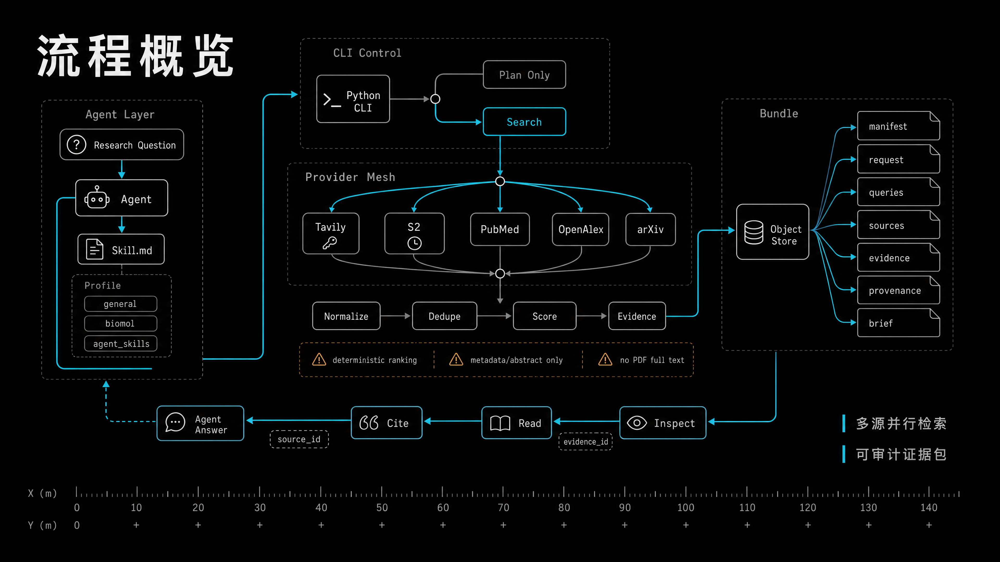

# deep-web-search-skill

Standalone Deep Web Search skill for traceable academic and technical literature search.

This repository contains an installable Agent skill plus a small standard-library Python search script. It can run academic deep searches without package installation or shell aliases; key-backed providers are configured with environment variables.

## Flow Overview



## Layout

```text
deep-web-search-skill/
  skills/
    deep-web-search/
      SKILL.md
      references/
        bundle-contract.md
      scripts/
        deep_web_search.py
        deep_web_search_lib/
          cli.py
          bundle.py
          models.py
          net.py
          providers.py
          queries.py
          ranking.py
  tests/
    test_deep_web_search.py
  evals/
    evals.json
```

## What It Does

- Generates profile-aware academic search queries.
- Refines long "similar work" titles into mechanism-focused query plans.
- Searches Tavily, Semantic Scholar, PubMed/NCBI, OpenAlex, and arXiv.
- Deduplicates, ranks, and writes traceable source/evidence records.
- Produces a presentation-ready `brief.md` plus JSON/JSONL audit records.

## Configuration / Keys

Configuration is environment-variable based. There is no `.env` loader in the script; export variables in the shell/session that runs the skill.

| Provider | Environment variables | Notes |
| --- | --- | --- |
| Tavily | `TAVILY_API_KEY`, optional `TAVILY_BASE_URL` | Required when using `tavily`. |
| Semantic Scholar | `S2_API_KEY` or `Semantic_Search_API_KEY` | Optional but recommended for higher rate limits. |
| PubMed/NCBI | `NCBI_EMAIL`, optional `NCBI_API_KEY` | Email is recommended by NCBI; API key is optional. |
| OpenAlex | `OPENALEX_EMAIL` | Optional polite-pool email. |
| arXiv | none | No API key required. |

Example:

```bash
export TAVILY_API_KEY="..."
export S2_API_KEY="..."
export NCBI_EMAIL="you@example.com"
export NCBI_API_KEY="..."        # optional
export OPENALEX_EMAIL="you@example.com"
```

This standalone skill does not call an LLM or embedding API internally. The Agent should read the generated bundle and do any synthesis itself.

Requirements:

- Python 3.
- Network access to the selected providers.

Supported providers are configured with `--providers`:

```bash
python3 skills/deep-web-search/scripts/deep_web_search.py search "$QUESTION" \
  --providers tavily,semantic_scholar,pubmed,openalex,arxiv \
  --progress \
  --out ./deep-web-search-bundle
```

Provider calls run in parallel by default with `--workers 5`. Semantic Scholar requests are still limited to one request per second inside the script. Use `--workers 1` for fully serial execution when debugging or when another provider rate limit is tight.

Use `--progress` when running inside an Agent harness that streams terminal output. Progress lines are written to stderr and do not change the generated bundle files.

## Implementation Split

`scripts/deep_web_search.py` stays as the stable CLI entry point. The implementation is split into `scripts/deep_web_search_lib/`:

- `cli.py`: command parsing and search orchestration.
- `queries.py`: profile-aware and mechanism-focused query planning.
- `providers.py`: Tavily, Semantic Scholar, PubMed/NCBI, OpenAlex, and arXiv adapters.
- `ranking.py`: deduplication, scoring, focusing, and evidence row generation.
- `bundle.py`: manifest, JSONL outputs, inspection, and `brief.md` rendering.
- `models.py` / `net.py`: shared records, constants, file writing, and HTTP helpers.

## Local Installation

Install by symlinking the skill folder into the Agent skill directory. Example:

```bash
ln -s /Users/jxtang/Desktop/CodeProjects/deep-web-search-skill/skills/deep-web-search \
  "$CODEX_HOME/skills/deep-web-search"
```

If the target Agent does not support symlinks, copy only `skills/deep-web-search/`.

## Operating Model

An Agent using this skill should:

1. Read `skills/deep-web-search/SKILL.md`.
2. Run `python3 skills/deep-web-search/scripts/deep_web_search.py search "$QUESTION" --out ./deep-web-search-bundle`.
3. Run `python3 skills/deep-web-search/scripts/deep_web_search.py inspect ./deep-web-search-bundle`.
4. Read the generated bundle files and cite `source_id` / `evidence_id` in follow-up work.
